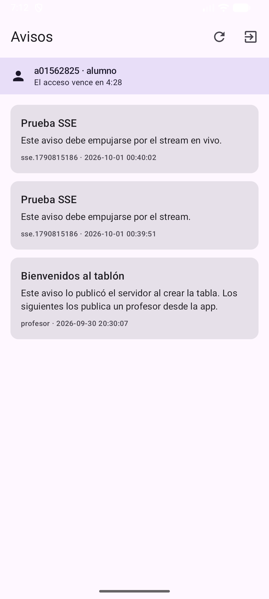
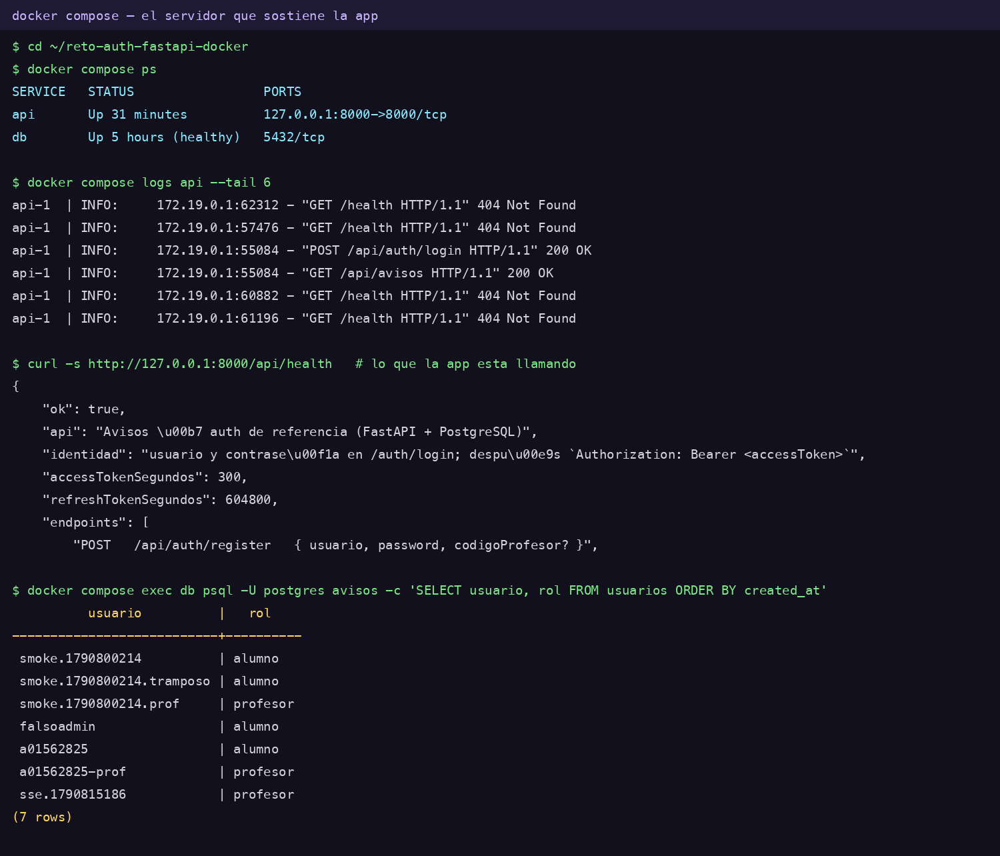

# Práctica 6 — Avisos

Proyecto de la Práctica 6 de TC2007B, completado hasta el checkpoint final.

Es un tablón de avisos con login contra la API del curso. El login crea una
sesión persistente en DataStore. Los tokens se cifran con Android Keystore;
la capa de red agrega el token de acceso y lo renueva cuando vence. El servidor
valida los permisos de publicación y el cierre de sesión revoca el refresh.

## Cómo empezar

1. Clona el repositorio y ábrelo en Android Studio.
2. Espera a que Gradle sincronice y corre la app: debes ver la pantalla de login.
3. Abre https://startdroid.com/consola.html y regístrate desde el navegador.
   Es la Parte 0 de la guía, y va antes de escribir código.
4. Consulta la guía: https://startdroid.com/practicas/avisos.html

## Cómo trabajar

Haz un commit en cada checkpoint de la guía:

    git add -A ; git commit -m "checkpoint a2"

Si algo se rompe sin remedio, `git restore .` te regresa al último checkpoint bueno.

Los experimentos que rompen el código a propósito van en una rama:

    git switch -c experimento-c2     # antes de romper nada
    git switch main                  # el código bueno vuelve solo

## Lo que nunca va en este repositorio

Tu contraseña, tus tokens, y el código de profesor. Ninguno de los tres se
escribe en el código: la contraseña se teclea, los tokens los guarda la app
cifrados en el teléfono, y el código se da en clase.

## Uso de IA

Todo commit con código generado por IA debe declararlo con un trailer
`Co-Authored-By`. Ver la política completa en la guía.

## Evidencias

- [Reproducir los videos en el navegador](https://ivanburrolatorres.github.io/practica-6-A01562825/docs/)
- [Video: sesión y renovación](https://github.com/IvanBurrolaTorres/practica-6-A01562825/raw/refs/heads/main/entregables/Laboratorio_6_Avisos_Sesion_y_Refresh.mp4)
- [Video: permisos y revocación](https://github.com/IvanBurrolaTorres/practica-6-A01562825/raw/refs/heads/main/entregables/Laboratorio_6_Avisos_Permisos_y_Revocacion.mp4)
- [Bitácora](docs/bitacora.md) y [resultados de verificación](docs/verificacion.md)

Los dos videos también están en `entregables/` y en el Escritorio.

### La misma app contra el servidor propio

Estas dos capturas son del anexo de identidad con Docker (FastAPI + PostgreSQL), no de la API del curso. La misma app, sin cambiar una línea de Kotlin más que `BASE_URL`, servida por el contenedor `api` sobre un PostgreSQL en el contenedor `db`.

| | |
| --- | --- |
|  |  |
| El tablón cargado y el banner con el usuario. | `docker compose ps`, los logs viendo las peticiones de la app, y la tabla `usuarios`. |

La prueba de que las dos fotos son el mismo sistema está en una línea de los logs del servidor:

    api-1 | INFO: 172.19.0.1:55084 - "POST /api/auth/login HTTP/1.1" 200 OK
    api-1 | INFO: 172.19.0.1:55084 - "GET  /api/avisos   HTTP/1.1" 200 OK

Esas dos peticiones son las únicas que hizo la app. La segunda solo funcionó porque hay un PostgreSQL dentro del contenedor `db`. El texto de la consola está en [`docs/capturas/docker-evidencia.txt`](docs/capturas/docker-evidencia.txt).

## Entrega

Ver la rúbrica en la guía.
